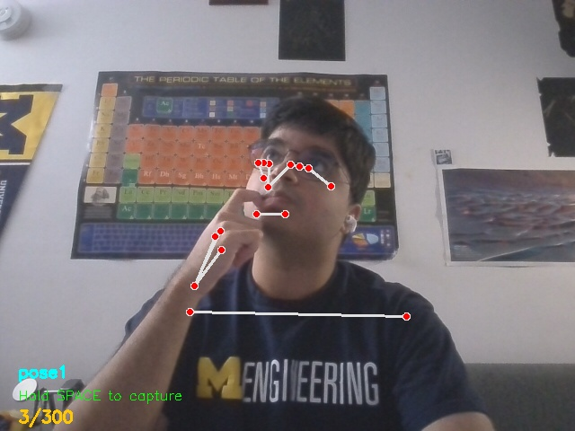
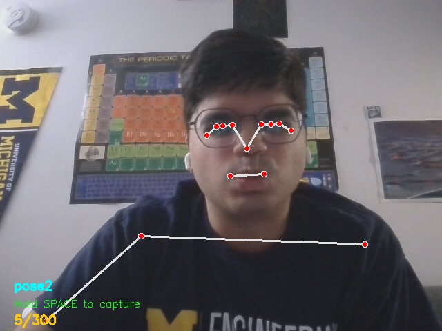
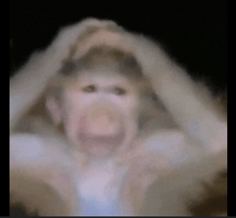
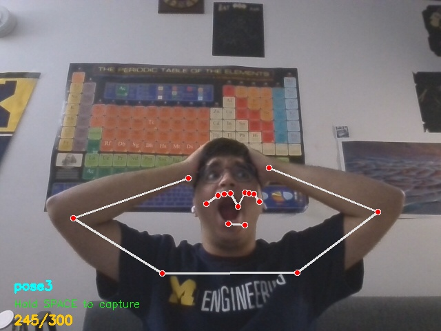
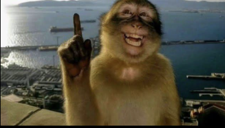
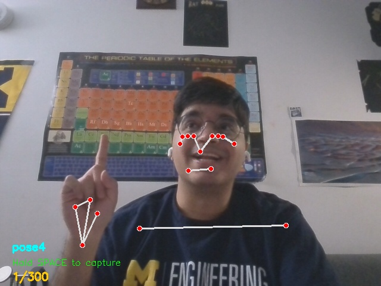

# MonkeyesInParis

Face recognition model for the Monkey Meme

Meme: https://www.instagram.com/p/DLk4h-ARGEJ/

The model is using a mediapipe system to create nodes to recognize certain poses which a trained model will determine if it is one of the 4 "meme" poses below.

**Authors: Sandeep Sawhney (ssawhney@umich.edu) & Ibrahim Quaizar (ibrahim.quaizar@stonybrook.edu)**

Contributors: Logan Schwandner (schlogan@umich.edu), Andrew Yang (yangandy@umich.edu), Isaac Yu (isaacyu@umich.edu)

